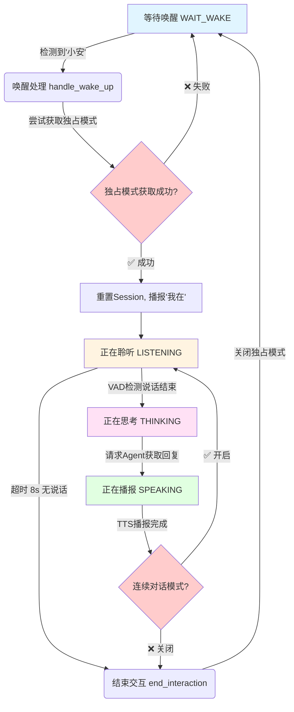

# 语音交互
## 语音交互流程图

```mermaid
graph TD
    A[等待唤醒 WAIT_WAKE] -->|检测到'小安'| B(唤醒处理 handle_wake_up)
    B -->|尝试获取独占模式| B1{独占模式获取成功?}
    B1 -->|❌ 失败| A
    B1 -->|✅ 成功| B2[重置Session, 播报'我在']
    B2 --> C[正在聆听 LISTENING]
    
    C -->|VAD检测说话结束| D[正在思考 THINKING]
    C -->|超时 8s 无说话| F(结束交互 end_interaction)
    
    D -->|请求Agent获取回复| E[正在播报 SPEAKING]
    
    E -->|TTS播报完成| E1{连续对话模式?}
    E1 -->|✅ 开启| C
    E1 -->|❌ 关闭| F
    
    F -->|关闭独占模式| A
    
    style A fill:#e1f5ff
    style C fill:#fff4e1
    style D fill:#ffe1f5
    style E fill:#e1ffe1
    style B1 fill:#ffcccc
    style E1 fill:#ffcccc
```
