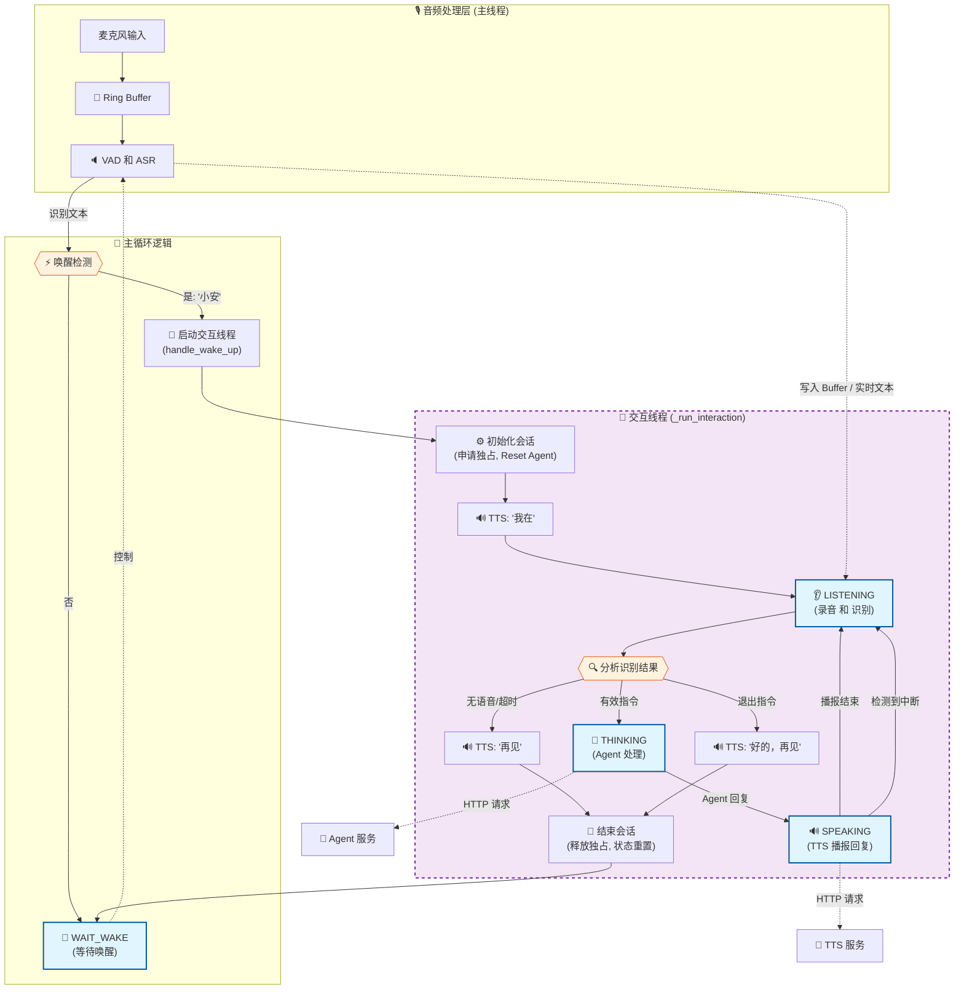
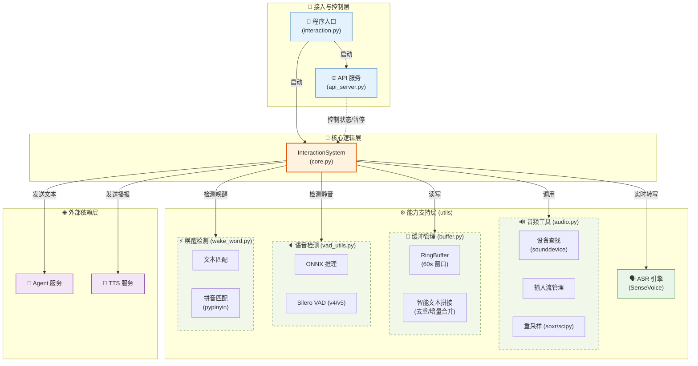

# Interaction 语音交互系统

## 系统概述

Interaction 项目是构建在 `streaming_sensevoice` 基础之上的实时语音交互系统。它集成了语音唤醒、流式语音识别 (ASR)、语义理解 (Agent) 和语音合成 (TTS) 控制，旨在提供流畅的人机对话体验。

核心识别能力由 `streaming_sensevoice` 模块提供，其代码位于工作空间的以下路径：
`../streaming_sensevoice_master/streaming_sensevoice`

## 系统架构

系统采用事件驱动的状态机设计，主要包含以下核心组件：

1.  **Audio Loop**: 负责音频采集、缓冲和 VAD (语音活动检测)。
2.  **ASR Engine**: 基于 SenseVoice 的流式语音识别引擎。
3.  **Interaction Core**: 核心状态机，协调唤醒、识别、思考和播报状态。
4.  **API Server**: 提供外部控制接口 (端口 8004)。

### 系统架构与状态流转

本节展示了系统的**功能架构（状态流转）**和**软件架构（组件关系）**。

#### 1. 交互流程图

下图展示了 Interaction 系统的运行流程。系统分为**主循环**（负责唤醒检测）和**交互会话**（负责多轮对话）两个主要部分。



#### 2. 软件组件架构图

下图展示了系统的分层模块结构，从上至下依次为接入层、核心层、能力层和外部服务层。特别细化了能力支持层中 `utils` 模块的功能。



## 核心模块

### 1. InteractionSystem (`core.py`)
系统的主控制器，采用双层循环设计：
-   **外层循环**: 处于 `WAIT_WAKE` 状态，持续分析音频流，检测唤醒词。
-   **内层会话 (`_run_interaction`)**: 一旦唤醒，启动独立线程进入交互会话。会话中包含一个 `while True` 循环，支持**多轮对话**。每一轮对话结束后（TTS 播报完成），系统会自动再次进入 `LISTENING` 状态，直到发生超时或用户明确说出“退出”、“再见”等指令。

### 2. StreamingSenseVoice
提供流式 ASR 能力。支持上下文 (Context) 偏置，用于提高唤醒词和特定指令的识别率。

### 3. API Server (`api_server.py`)
运行在 8004 端口，提供 HTTP 接口用于：
-   获取系统状态
-   控制唤醒检测的暂停/恢复 (用于 TTS 播报时的回声消除或独占模式)
-   获取音频缓冲区内容的非侵入式接口

## 目录结构与代码功能

以下是 `interaction` 项目的文件组织结构及其功能说明：

```text
interaction/
├── interaction.py          # 🚀 程序入口
│                           #    - 初始化环境路径
│                           #    - 启动 API Server 线程
│                           #    - 启动 InteractionSystem 主循环
│
├── core.py                 # 🧠 核心业务逻辑
│                           #    - 状态机实现 (WAIT_WAKE, LISTENING, etc.)
│                           #    - 协调 ASR, Agent, TTS, VAD
│                           #    - 实现多轮对话流程
│
├── api_server.py           # 🔌 HTTP 接口服务 (FastAPI, Port 8004)
│                           #    - 提供状态查询 /status
│                           #    - 提供唤醒控制 /wake/pause, /wake/resume
│                           #    - 提供音频缓冲回溯 /listen_recent
│
├── context.py              # 🔄 全局上下文
│                           #    - 解决循环依赖，持有 InteractionSystem 单例
│
├── utils/                  # 🛠️ 工具模块
│   ├── audio.py            #    - 麦克风设备查找、音频流创建、重采样
│   ├── buffer.py           #    - 音频环形缓冲区 (RingBuffer) 实现
│   ├── vad_utils.py        #    - VAD 数据结构与辅助函数
│   └── wake_word.py        #    - 唤醒词检测逻辑 (基于文本匹配)
│
└── docs/                   # 📚 文档目录
    ├── interaction.md      #    - 项目主文档 (架构、流程)
    └── interface/          #    - 接口文档目录
        └── server_interaction.md
```
