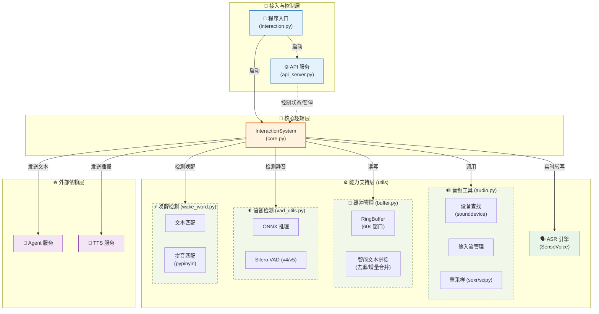

```mermaid
graph TB
    subgraph Layer1 ["🔌 接入与控制层"]
        direction TB
        Entry["🚀 程序入口<br/>(interaction.py)"]
        API["🌐 API 服务<br/>(api_server.py)"]
    end

    subgraph Layer2 ["🧠 核心逻辑层"]
        Core["InteractionSystem<br/>(core.py)"]
    end

    subgraph Layer3 ["⚙️ 能力支持层 (utils)"]
        direction LR
        
        subgraph AudioUtils ["🔊 音频工具 (audio.py)"]
            Device["设备查找<br/>(sounddevice)"]
            Stream["输入流管理"]
            Resample["重采样 (soxr/scipy)"]
        end
        
        subgraph BufferUtils ["🔄 缓冲管理 (buffer.py)"]
            RingBuf["RingBuffer<br/>(60s 窗口)"]
            Merge["智能文本拼接<br/>(去重/增量合并)"]
        end
        
        subgraph VADUtils ["🔈 语音检测 (vad_utils.py)"]
            ONNX["ONNX 推理"]
            Silero["Silero VAD (v4/v5)"]
        end
        
        subgraph WakeUtils ["⚡ 唤醒检测 (wake_word.py)"]
            TextMatch["文本匹配"]
            Pinyin["拼音匹配<br/>(pypinyin)"]
        end
        
        ASR["🗣️ ASR 引擎<br/>(SenseVoice)"]
    end

    subgraph Layer4 ["🌐 外部依赖层"]
        direction LR
        Agent["🤖 Agent 服务"]
        TTS["📢 TTS 服务"]
    end

    %% 启动与控制
    Entry -->|启动| Core
    Entry -->|启动| API
    API -.->|控制状态/暂停| Core

    %% 核心依赖
    Core -->|调用| AudioUtils
    Core -->|读写| BufferUtils
    Core -->|检测静音| VADUtils
    Core -->|检测唤醒| WakeUtils
    Core -->|实时转写| ASR

    %% 外部交互
    Core -->|发送文本| Agent
    Core -->|发送播报| TTS

    %% 样式优化
    classDef layer1 fill:#e3f2fd,stroke:#1565c0,stroke-width:1px;
    classDef layer2 fill:#fff3e0,stroke:#e65100,stroke-width:2px;
    classDef layer3 fill:#e8f5e9,stroke:#2e7d32,stroke-width:1px;
    classDef layer4 fill:#f3e5f5,stroke:#7b1fa2,stroke-width:1px;
    classDef utils fill:#f1f8e9,stroke:#558b2f,stroke-width:1px,stroke-dasharray: 5 5;

    class Entry,API layer1;
    class Core layer2;
    class ASR,VADUtils,AudioUtils,BufferUtils,WakeUtils layer3;
    class Agent,TTS layer4;
    class AudioUtils,BufferUtils,VADUtils,WakeUtils utils;
```