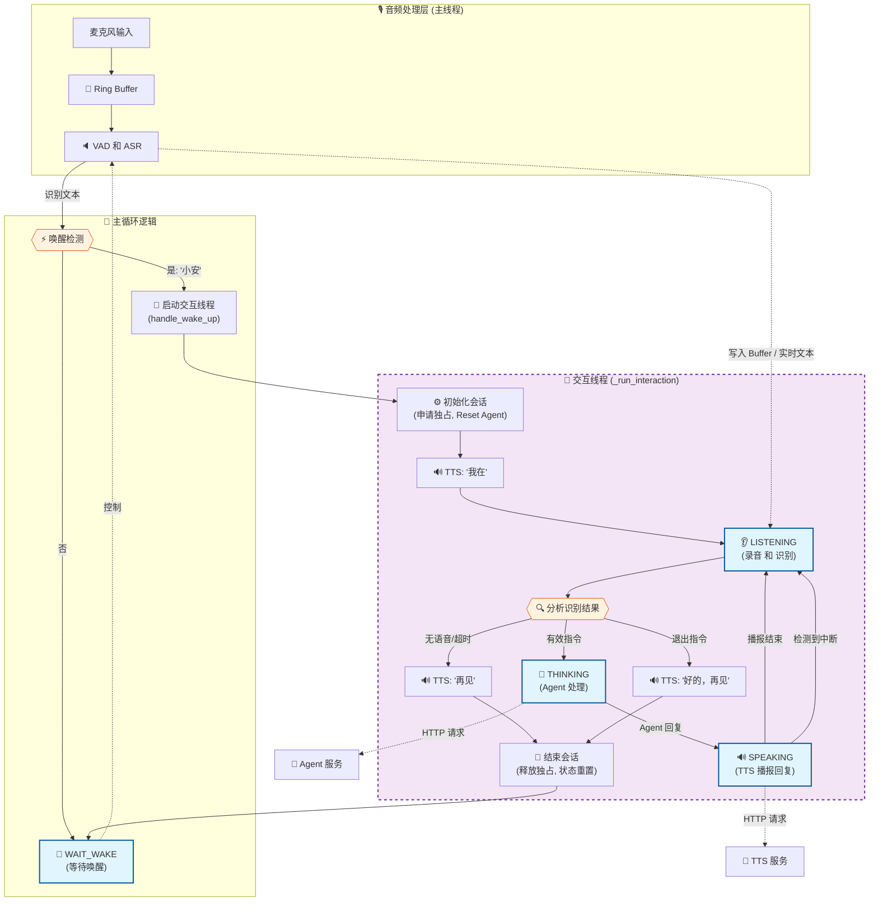

```mermaid
graph TB
    subgraph AudioProcessing ["🎙️ 音频处理层 (主线程)"]
        direction TB
        Mic["麦克风输入"] --> Buffer["🔄 Ring Buffer"]
        Buffer --> VAD["🔈 VAD 和 ASR"]
    end

    subgraph MainLoop ["🔄 主循环逻辑"]
        StateWait["🛑 WAIT_WAKE<br/>(等待唤醒)"]
        WakeCheck{{"⚡ 唤醒检测"}}
        
        %% 连接音频层与主循环
        VAD -->|识别文本| WakeCheck
        StateWait -.->|控制| VAD
        
        WakeCheck -->|否| StateWait
        WakeCheck -->|是: '小安'| StartSession["🚀 启动交互线程<br/>(handle_wake_up)"]
    end

    subgraph InteractionThread ["🧵 交互线程 (_run_interaction)"]
        direction TB
        
        StartSession --> InitSession["⚙️ 初始化会话<br/>(申请独占, Reset Agent)"]
        InitSession --> SayHi["🔊 TTS: '我在'"]
        SayHi --> StateListen
        
        StateListen["👂 LISTENING<br/>(录音 和 识别)"]
        
        %% 连接音频层与交互线程
        VAD -.->|写入 Buffer / 实时文本| StateListen
        
        AnalyzeResult{{"🔍 分析识别结果"}}
        StateListen --> AnalyzeResult
        
        AnalyzeResult -->|无语音/超时| SayBye1["🔊 TTS: '再见'"]
        AnalyzeResult -->|退出指令| SayBye2["🔊 TTS: '好的，再见'"]
        AnalyzeResult -->|有效指令| StateThink
        
        SayBye1 --> EndSession["👋 结束会话<br/>(释放独占, 状态重置)"]
        SayBye2 --> EndSession
        
        StateThink["🤔 THINKING<br/>(Agent 处理)"]
        StateSpeak["🔊 SPEAKING<br/>(TTS 播报回复)"]
        
        StateThink -->|Agent 回复| StateSpeak
        StateSpeak -->|播报结束| StateListen
        StateSpeak -->|检测到中断| StateListen
    end

    EndSession --> StateWait

    %% 外部服务连接
    StateThink -.->|HTTP 请求| Agent["🤖 Agent 服务"]
    StateSpeak -.->|HTTP 请求| TTS["📢 TTS 服务"]
    
    %% 样式定义
    classDef state fill:#e1f5fe,stroke:#01579b,stroke-width:2px;
    class StateWait,StateListen,StateThink,StateSpeak state;
    
    classDef logic fill:#fff3e0,stroke:#e65100,stroke-width:1px;
    class WakeCheck,AnalyzeResult logic;
    
    classDef session fill:#f3e5f5,stroke:#7b1fa2,stroke-width:2px,stroke-dasharray: 5 5;
    class InteractionThread session;
```